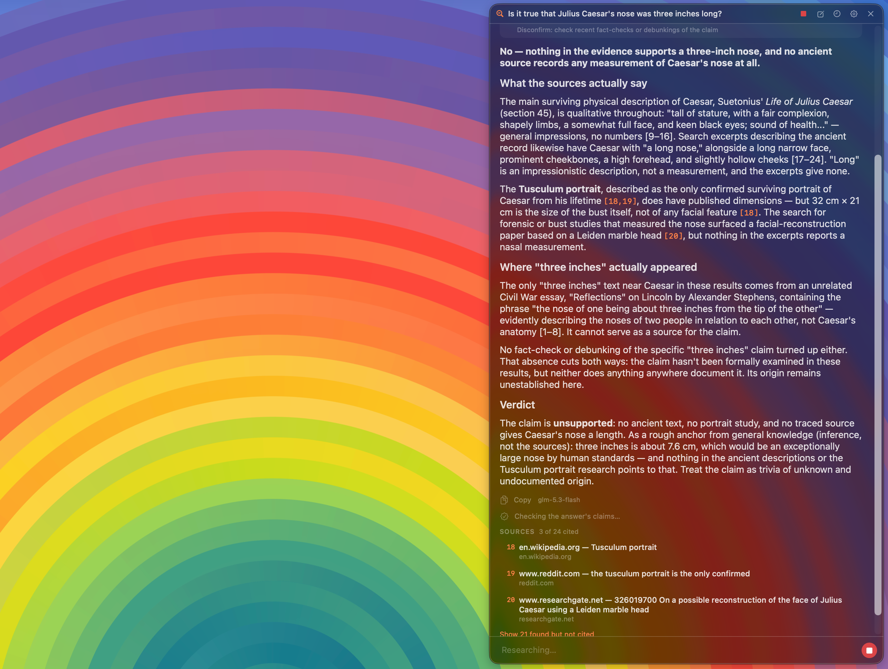

# Vervellum

A hotkey-summoned research panel for macOS and Linux. It looks things up, then shows its work.

**Latest release:** v<!-- version -->0.2.0<!-- /version --> · [Download](https://github.com/L-K-M/Vervellum/releases/latest)



> [!IMPORTANT]
> LLM Disclosure: Vervellum was built with substantial help from large language models.

Press ⌃⌥⌘Space anywhere, even over another app's full-screen window, and a panel
slides in at the edge of the screen. Type a question. Vervellum plans web searches,
runs them, streams an answer that cites only what it actually found, and then grades
its own claims against that same evidence.

## Why it's not a chat window

Most floating LLM panels answer straight from the model's weights. Vervellum instead
runs the searches and answers based on current sources.

- **Only retrieved citations become links.** Vervellum owns the numbered source
  list. Answers cite `[1]` or `[2, 5]`; model-written URLs stay non-actionable and
  are flagged. A real citation still does not prove a claim.
- **Claims get a separate assessment.** Findings are *supported*, *contradicted*,
  *mixed*, *not established*, or *opinion*. The first three require citations.
  Failed assessments retain the answer with a warning, not a verified verdict.
- **Finding nothing is a result.** *Not established* is a normal outcome, not an
  error state. It gives the model a place to put a claim the evidence doesn't
  support.
- **You can watch it work.** What it decided to look up, what it searched for, how
  many sources it kept, how many the answer actually cites. The detail is visible
  while it runs and collapses to one line once it's done.
- **It reads the pages, and says which ones.** Search results are summaries, and a
  citation to a page nobody read is the weakest link in the chain — so Vervellum fetches
  the pages behind the top few sources and gives the model their text alongside the
  summary. Each source row says which it was: **page read**, or search summary. A page
  that was fetched but didn't fit the model's context is listed as a summary, because
  that is what the answer actually had.

## Features

- **Summon from anywhere.** A global shortcut that needs no permission and works
  over another app's full-screen window without switching Spaces.
- **Threaded.** Follow-up questions carry the thread's context, including which
  earlier claims were left unsettled. Threads are searchable, and it's up to you
  whether they're kept at all, and how many are kept — older ones past the limit are
  deleted, and lowering it takes effect immediately rather than at the next question
  (on screen at once, and on disk with the save that follows). A limit lowered behind
  the app's back — a hand edit, a sync tool — is different: that one trims in memory at
  the next launch and leaves the file alone, so raising it again brings the threads
  back — at the *next* launch, and only if nothing was saved in between. The trim the
  running app already did is in memory, and raising the limit cannot undo it: nothing
  restores a thread the list has dropped, it is re-read from the file that still has it.
  Be aware how small "until something is saved" is, though: asking one question
  writes the trimmed list, and that is what makes the trim permanent. The write rotates
  the previous file to `threads.json.bak` first, so there is one more chance after that
  and no more. Active turns are
  checkpointed; interrupted work
  reopens as incomplete, with its partial answer retained.
- **Keyboard-first.** `Return` asks, `Esc` clears then closes, `↑`/`↓` walk back
  through earlier questions, `/` opens commands. Everything in the header is also a
  command.
- **Ask while it's still working.** The composer never locks. A follow-up typed during
  a run waits its turn and starts on its own, listed above the composer and removable
  until it does. Stop cancels what is waiting too, and puts the text back in the
  composer rather than discarding it.
- **Settings you can watch work.** The panel's edge, width, height and text size apply
  to an open panel as you change them. Opening Settings dismisses the panel — it would
  otherwise cover the window it was opened from — so **Settings ▸ General ▸ Preview**
  puts it back beside Settings while you adjust it.
- **Research the selection.** An optional second shortcut opens the panel with
  whatever text you had selected, with credential-shaped values stripped out first.
- **`/direct`** answers with no search at all, and is clearly badged as unsourced.
- **Bring your own providers.** An OpenAI-compatible Chat Completions endpoint, and
  for search either an HTTP MCP server — recognized tools include z.ai, Brave, Tavily,
  Exa and SearXNG, and only recognized tool names are accepted — or a **SearXNG
  instance queried directly**, with no MCP bridge in between. Model replies must
  finish with `finish_reason: stop`; malformed or unfinished replies remain
  incomplete. Keys live in your Keychain on macOS, one per configured provider.
- **As many models as you want, chosen per question.** Configure several providers —
  a local server, a fast hosted model, a careful one — each with its own endpoint and
  its own key. Pick the one that answers next from the panel or with `/model`; every
  turn records the model that produced it.
- **Three ways to read a page.** **Snippets only** is the old behaviour. **Fetch
  directly** is the default: Vervellum requests the page itself, with no key, no cookie
  and no referrer — the only thing it does that contacts a site you didn't configure, so
  the site sees your address. **A reader service** ([z.ai's Web Reader MCP
  server](https://docs.z.ai/devpack/mcp/reader-mcp-server), or any MCP server with a
  compatible tool) fetches them instead, so the sites see the service and the service
  sees the URLs. Settings ▸ Providers ▸ Reading the page.
- **Native.** SwiftUI and AppKit, Liquid Glass on macOS 26, no dependencies.

## Getting started

### macOS

1. Launch Vervellum. It appears as a magnifier in the menu bar.
2. Open **Settings ▸ Providers** and fill in a model endpoint, a model name, and a
   web-search key. The panel offers this on first launch, because nothing works
   without it. **Add a provider** puts a second model beside the first; the panel and
   `/model` switch between them.
3. Press **⌃⌥⌘Space** and ask something.

### Linux (Ubuntu 24.04+)

```bash
sudo apt install ./vervellum_0.1.0_amd64.deb
vervellum --install-shortcut          # binds ⌃⌥⌘Space in GNOME
```

Configure it by editing `~/.config/vervellum/settings.json`:

```json
{
  "modelEndpoint": "https://api.example.com/v1",
  "modelName": "your-model",
  "searchEndpoint": "https://api.z.ai/api/mcp/web_search_prime/mcp"
}
```

The behaviour toggles are the same keys the macOS Settings window writes:
`historyEnabled`, `showProcessTrail`, `submitOnReturn` (booleans) and `textScale`
(0.85–1.4). The file is read at launch.

To search a SearXNG instance instead, set `searchProvider` and point `searchEndpoint`
at the instance (its home page is enough — `/search` is appended):

```json
{
  "searchProvider": "searxng",
  "searchEndpoint": "https://searx.example.org"
}
```

Page reading is `pageReading`, one of `"off"`, `"direct"` or `"reader"` (default
`"direct"`), with `readerEndpoint` for the reader service and its key in
`VERVELLUM_READER_KEY` or the keyring under `reader-api-key`.

> [!IMPORTANT]
> A SearXNG instance must list `json` under `search.formats` in its `settings.yml`.
> Most do not by default, and one that does not answers HTTP 403. SearXNG itself takes
> no API key; store one only if your instance sits behind an authenticating proxy.

`modelEndpoint` and `modelName` describe one provider, which is all the Linux build
writes and the shape shown above. The macOS app can configure several and stores them
under `modelProviders` (a JSON list) with `selectedModelProvider`; when that list is
present it wins, and `modelEndpoint`/`modelName` are kept as a mirror of whichever
provider is selected. `/model` lists them and switches between them on Linux too. Search
providers work the same way: `searchProviders`/`selectedSearchProvider` for the list,
`searchEndpoint`/`searchProvider` as the mirror.

Then store the keys in your login keyring, or export them:

```bash
secret-tool store --label "Vervellum model-api-key" \
    service ch.lkmc.Vervellum account model-api-key
export VERVELLUM_MODEL_KEY=…  VERVELLUM_SEARCH_KEY=…
```

No desktop at all? `vervellum --ask "your question"` runs the whole pipeline and
prints the answer, its verdicts, and its sources. It needs no display and no
session bus.

> [!NOTE]
> On GNOME Wayland the Linux build is an ordinary window, not an edge-docked
> overlay. A Wayland client can't position its own window or keep it above others,
> and GNOME doesn't implement the layer-shell protocol that would allow it
> (`gtk_window_move` and `set_keep_above` don't exist in GTK4 at all). The
> shortcut, the pipeline, and the evidence UI all work; window placement is up to
> the compositor.

History now uses schema 2. **Do not downgrade with the same history file:** older
releases can mistake new notices for corruption and overwrite it. Back up history
before downgrading. See [SECURITY.md](SECURITY.md).

## Build & Run

### Linux

Needs a **Swift 6.0+** toolchain (earlier ones lack the async `URLSession` methods
on Linux) plus `libgtk-4-dev` and `pkg-config`.

```bash
swift build -c release --product vervellum
swift test --parallel            # the shared core's tests
packaging/build-deb.sh 0.1.0     # -> build/vervellum_0.1.0_<arch>.deb
```

### macOS

Requires **Xcode 26** (for Liquid Glass) and **macOS 14+** (Liquid Glass renders on
macOS 26; older systems get a blurred fallback).

```bash
# Build
xcodebuild -project Vervellum.xcodeproj -scheme Vervellum -configuration Debug build

# Release build
xcodebuild -project Vervellum.xcodeproj -scheme Vervellum -configuration Release build

# Run unit tests
xcodebuild -project Vervellum.xcodeproj -scheme Vervellum -destination 'platform=macOS' test
```

`scripts/build.sh` does an incremental Release build through the shared `lkm-build`
engine (`scripts/build.sh --clean` for a clean rebuild).

## Permissions

**macOS: the core app needs none.** The global shortcut uses the system's own
hotkey registration rather than a keyboard monitor, so it works the moment you
launch the app. That matters in full screen, where the menu bar is hidden and the
shortcut is the only way in.

One optional feature needs one permission: **Research the Selection** reads the
frontmost app's selected text through **Accessibility**. It's off by default, it
explains itself before macOS shows its own prompt, and everything else works
without it.

> [!NOTE]
> Release builds are ad-hoc signed (see Distribution). macOS ties an Accessibility
> grant to an app's code signature, and an ad-hoc signature changes with every
> build, so **every update resets this one permission**. Vervellum notices and
> tells you what happened instead of failing quietly. Remove it from the
> Accessibility list and add it again to restore the feature.

## Privacy

Your question, the thread, and the search results go to the two providers you
configure, and nowhere else. There's no account system and no telemetry or
analytics. Threads and preferences stay on your machine. API keys live in the
Keychain on macOS. Linux reads explicit environment keys first, then the keyring,
then an unencrypted mode-0600 file. Text captured by the macOS selection shortcut is scanned for
credential-shaped values before it reaches the composer, and you're told how many
were removed. See [PRIVACY.md](PRIVACY.md).

## Distribution

Non-sandboxed and outside the Mac App Store, because the sandbox can't grant the
Accessibility access the selection feature needs. CI publishes an **unsigned,
un-notarized** build for each tag, ad-hoc signed only so it will launch on Apple
Silicon. Gatekeeper will warn on first launch:

```bash
xattr -dr com.apple.quarantine /Applications/Vervellum.app
```

Or right-click the app → **Open** → **Open**.

The Linux `.deb` is unsigned as well. It's built in the official Swift container
for Ubuntu 24.04, links the Swift runtime statically, and declares its remaining
dependencies with `dpkg-shlibdeps` instead of a hand-written list.
